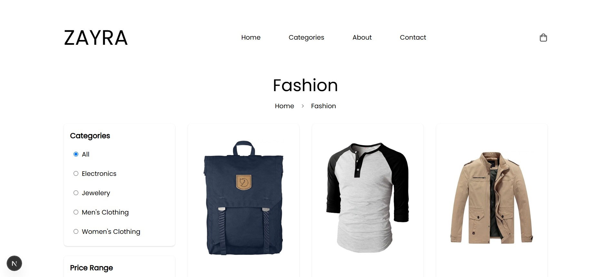

# ZAYRA E-commerce

A modern e-commerce platform built with Next.js 15, featuring a clean design and smooth shopping experience.

## 🌟 Features

### Shopping Experience
- 🛍️ Browse products by categories (electronics, jewelry, men's clothing, women's clothing)
- 💰 Price range filtering
- ⭐ Product ratings and reviews
- 🛒 Shopping cart with real-time updates

### Technical Features
- ⚡ Server-side rendering with Next.js 15
- 📱 Responsive design for all devices
- 🎨 Modern UI with Tailwind CSS
- 🔄 Dynamic routing for product pages
- 💾 Client-side state management
- 🌐 SEO optimization with metadata
- 🔍 JSON-LD implementation for better search results

### Performance & UX
- ⚡ Fast page loads with image optimization
- 🎭 Skeleton loading states
- ⚠️ Error boundaries for graceful error handling
- 📱 Mobile-first design approach

## 🛠️ Technology Stack

- **Framework**: Next.js 15
- **Language**: TypeScript
- **Styling**: Tailwind CSS
- **State Management**: React Hooks & Zustand
- **Deployment**: Vercel
- **Image Optimization**: Next.js Image Component
- **SEO**: Next.js Metadata API
- **Error Handling**: React Error Boundary

## 🚀 Getting Started

### Prerequisites

- Node.js 18.x or later
- npm or yarn

### Installation

1. Clone the repository
\`\`\`bash
git clone https://github.com/mohamedsabrie/zayra.git
cd zayra
\`\`\`

2. Install dependencies
\`\`\`bash
npm install
# or
yarn install
\`\`\`

3. Run the development server
\`\`\`bash
npm run dev
# or
yarn dev
\`\`\`

4. Open [http://localhost:3000](http://localhost:3000) in your browser

## 📂 Project Structure

\`\`\`
src/
├── app/                   # Next.js 14 app directory
│   ├── product/          # Product pages
│   ├── cart/             # Shopping cart
│   └── layout.tsx        # Root layout
├── components/           # Reusable components
│   ├── ui/              # UI components
│   └── layout/          # Layout components
├── lib/                  # Utilities and helpers
│   ├── api/             # API functions
│   ├── utils/           # Utility functions
│   └── types/           # TypeScript types
└── hooks/               # Custom React hooks
\`\`\`

## 🎯 Key Features in Detail

### Product Catalog
- Dynamic product filtering by category
- Price range filtering
- Responsive product grid layout
- Product image optimization
- Detailed product pages with specifications

### Shopping Cart
- Add/remove items
- Quantity adjustment
- Price calculations
- Persistent cart state

### User Interface
- Responsive navigation
- Loading states for better UX
- Error handling with user-friendly messages
- Clean and modern design

### Performance
- Server-side rendering for fast initial load
- Image optimization for better performance
- Incremental Static Regeneration for product pages
- Efficient client-side navigation

## 🔄 State Management

- Client-side cart state management
- Server-side product data handling
- Efficient data caching strategy

## 📱 Responsive Design

- Mobile-first approach
- Breakpoints for various devices
- Optimized images for different screen sizes
- Touch-friendly interface

## 🚀 Deployment

The application is deployed on Vercel with:
- Automatic HTTPS
- Edge Network distribution
- Automatic deployments on push
- Preview deployments for PRs

## 📊 Performance Metrics

The application has been tested with Google PageSpeed Insights to ensure optimal performance. You can view the detailed performance report here:

[View Full Report](https://pagespeed.web.dev/analysis/https-zayra-beryl-vercel-app/ieo8r3h5mf?form_factor=mobile)

## 📞 Contact

For any questions or feedback, please reach out to [abosaadmohamed@gmail.com]

---

[Live Demo](https://zayra-beryl.vercel.app/)
